# DUST

DUST (Dual U-Net with Swin-Transformer) is designed for non-rigid registration of high-resolution 3D fluorescence microscopy images. It progressively aligns a moving volume to a fixed volume through two cascaded registration stages.

Each stage combines a 3D Swin-Transformer encoder with a U-Net decoder to estimate a dense displacement field. A 3D spatial transformer then warps the moving image, allowing the second stage to refine the first-stage result. Training combines image similarity and deformation smoothness, with optional Dice supervision when segmentation labels are available.

## Method Overview

  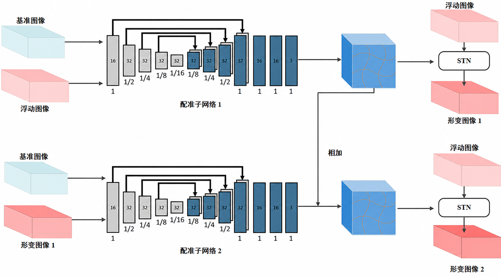

The first registration subnetwork estimates an initial deformation and produces the first warped image. The second subnetwork uses that intermediate result to refine the deformation and generate the final registered image.

For large volumes, the research workflow first estimates a global deformation on a downsampled volume and then performs local refinement on 3D patches.

## Synthetic Dataset Examples

Training pairs are created by applying artificial smooth deformations to fluorescence microscopy regions of interest and their corresponding synthetic label maps. The image and label in each column share the same deformation.

<table>
  <tr>
    <td width="25%" align="center">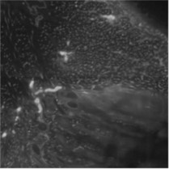</td>
    <td width="25%" align="center">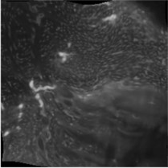</td>
    <td width="25%" align="center">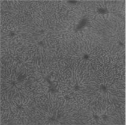</td>
    <td width="25%" align="center">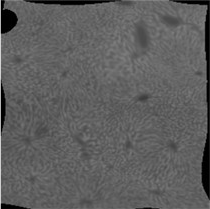</td>
  </tr>
  <tr>
    <td align="center">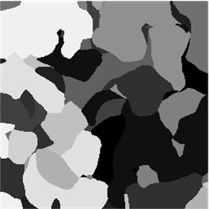</td>
    <td align="center">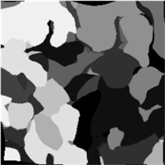</td>
    <td align="center">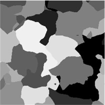</td>
    <td align="center">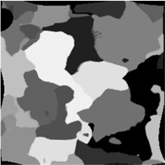</td>
  </tr>
  <tr>
    <td align="center"><strong>Fixed image 1</strong></td>
    <td align="center"><strong>Moving image 1</strong></td>
    <td align="center"><strong>Fixed image 2</strong></td>
    <td align="center"><strong>Moving image 2</strong></td>
  </tr>
</table>

Original composite examples: [sample 1](docs/dust-results/synthetic-dataset-example-1.jpg) and [sample 2](docs/dust-results/synthetic-dataset-example-2.jpg).

## Registration Results

### Qualitative comparison

The red boxes highlight the same anatomical region across the input images and registration results.

<table>
  <tr>
    <td width="14.28%" align="center">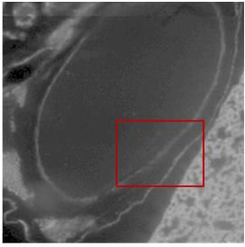</td>
    <td width="14.28%" align="center">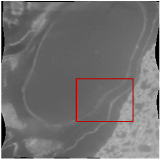</td>
    <td width="14.28%" align="center">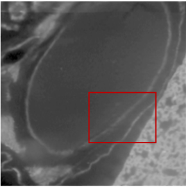</td>
    <td width="14.28%" align="center">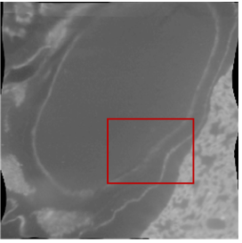</td>
    <td width="14.28%" align="center">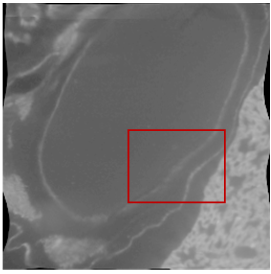</td>
    <td width="14.28%" align="center">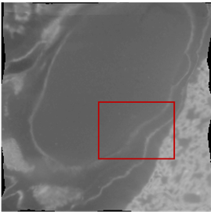</td>
    <td width="14.28%" align="center">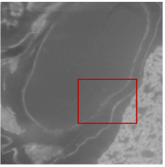</td>
  </tr>
  <tr>
    <td align="center"><strong>(a)</strong></td>
    <td align="center"><strong>(b)</strong></td>
    <td align="center"><strong>(c)</strong></td>
    <td align="center"><strong>(d)</strong></td>
    <td align="center"><strong>(e)</strong></td>
    <td align="center"><strong>(f)</strong></td>
    <td align="center"><strong>(g)</strong></td>
  </tr>
</table>

**Panel descriptions:** (a) fixed image; (b) moving image; (c) DUST; (d) TransMorph; (e) VoxelMorph; (f) Demons; (g) SyN.

Original vector figures: [panels (a)–(d)](docs/dust-results/qualitative-comparison-a-d.emf) and [panels (e)–(g)](docs/dust-results/qualitative-comparison-e-g.emf).

### Dynamic comparison

The previews play at their original speed. Click any preview to open the corresponding MP4.

<table>
  <tr>
    <td width="50%" align="center"><a href="docs/dust-results/original.mp4?raw=1">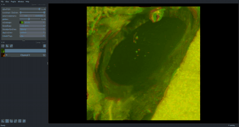</a> <strong>Original</strong></td>
    <td width="50%" align="center"><a href="docs/dust-results/dust.mp4?raw=1">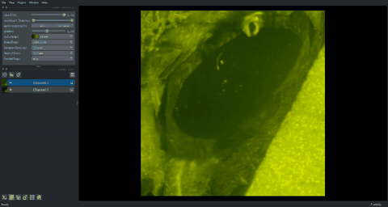</a> <strong>DUST</strong></td>
  </tr>
  <tr>
    <td width="50%" align="center"><a href="docs/dust-results/transmorph.mp4?raw=1">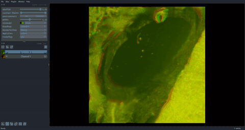</a> <strong>TransMorph</strong></td>
    <td width="50%" align="center"><a href="docs/dust-results/voxelmorph.mp4?raw=1">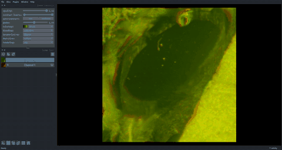</a> <strong>VoxelMorph</strong></td>
  </tr>
  <tr>
    <td width="50%" align="center"><a href="docs/dust-results/demons.mp4?raw=1">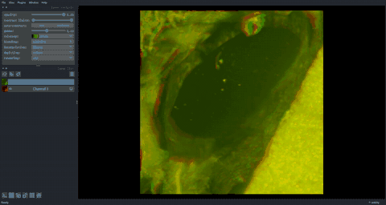</a> <strong>Demons</strong></td>
    <td width="50%" align="center"><a href="docs/dust-results/syn.mp4?raw=1">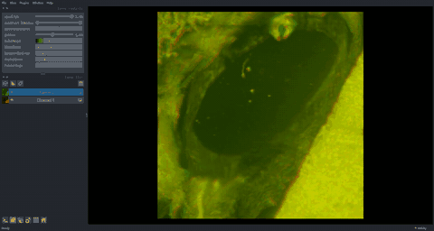</a> <strong>SyN</strong></td>
  </tr>
</table>

### Quantitative accuracy and runtime

Higher NCC, SSIM, and Dice values indicate better registration accuracy. DUST achieves the highest value for all three accuracy metrics in this comparison.

| Method | NCC ↑ | SSIM ↑ | Dice ↑ | Time (s) ↓ |
| :--- | ---: | ---: | ---: | ---: |
| VoxelMorph | 0.957 | 0.823 | 0.751 | 0.19 |
| TransMorph | 0.977 | 0.891 | 0.786 | 0.21 |
| **DUST** | **0.986** | **0.941** | **0.802** | 0.43 |
| SyN | 0.848 | 0.853 | 0.511 | 47.5 |
| Demons | 0.798 | 0.910 | 0.705 | 96.4 |

## Algorithms Used and Compared

DUST uses a 3D Swin-Transformer encoder, a U-Net-style decoder, dense displacement-field estimation, and spatial transformation in a dual-cascade architecture. Its training objectives include NCC-based image similarity, deformation-field smoothness, and optional Dice supervision.

The current codebase was developed from the [TransMorph](https://github.com/junyuchen245/TransMorph_Transformer_for_Medical_Image_Registration) implementation. The evaluation above compares DUST with TransMorph, [VoxelMorph](https://github.com/voxelmorph/voxelmorph), Demons, and SyN/ANTs. Their implementations are retained only where needed for reproducible baselines and comparison experiments.

The synthetic-label training strategy is inspired by [SynthMorph](https://arxiv.org/abs/2004.10282): synthetic label maps and controlled artificial deformations provide paired supervision without requiring a ground-truth deformation field from acquired microscopy data.

The research scripts currently contain dataset and checkpoint paths from the original experiment environment. Update those paths for your local NIfTI volumes and trained checkpoints before running them.

## License

This repository is distributed under the [MIT License](LICENSE).
