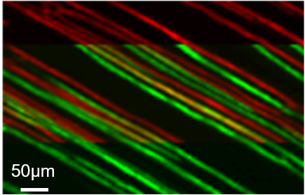
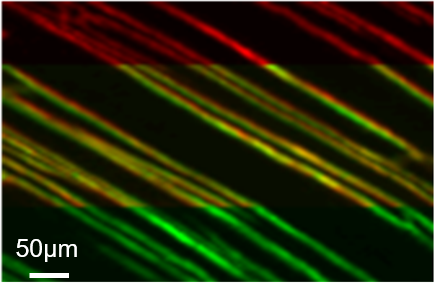

# Whole-Mouse 3D Reconstruction at Micron Resolution

An end-to-end method for transforming overlapping Blockface-VISoR image sections into a spatially continuous whole-body volume.

---

## 1. From Image Sections to a Continuous 3D Volume

The reconstruction pipeline resolves both intra-section displacement and nonlinear deformation between adjacent physical sections.

| Stage | Operation | Purpose |
| --- | --- | --- |
| **1. Intra-section stitching** | Align overlapping image stacks within each section | Recover a complete section volume |
| **2. Overlap registration** | Sample corresponding regions and estimate local displacement | Establish reliable cross-section correspondences |
| **3. Surface extraction** | Fit the displacement field and recover the deformed surface | Model non-planar section geometry |
| **4. Inter-section reconstruction** | Register adjacent surfaces and propagate the deformation through the volume | Produce a continuous whole-body reconstruction |

---

## 2. Stitching Quality Across Adjacent Sections

Red and green represent structures from two adjacent sections. Yellow indicates spatial agreement between them. After surface-aware registration, corresponding fibers overlap more closely and the discontinuity at the section boundary is substantially reduced.

<table>
  <tr>
    <td width="50%"></td>
    <td width="50%"></td>
  </tr>
  <tr>
    <td align="center"><strong>Before</strong> Fixed-plane registration leaves visible red-green displacement.</td>
    <td align="center"><strong>After</strong> Surface-aware registration restores fiber continuity and overlap.</td>
  </tr>
</table>

---

## 3. Whole-Body Reconstruction Result

The final Thy1-EGFP reconstruction demonstrates continuous nervous-system structures across the reconstructed whole-mouse volume.

<video controls preload="metadata" width="100%">
  <source src="docs/whole-body-thy1-reconstruction.mp4" type="video/mp4">
  Your browser does not support embedded MP4 playback.
</video>

### [Play the whole-body reconstruction video](docs/whole-body-thy1-reconstruction.mp4?raw=1)

The direct video link is provided for GitHub views that do not display the embedded player.
